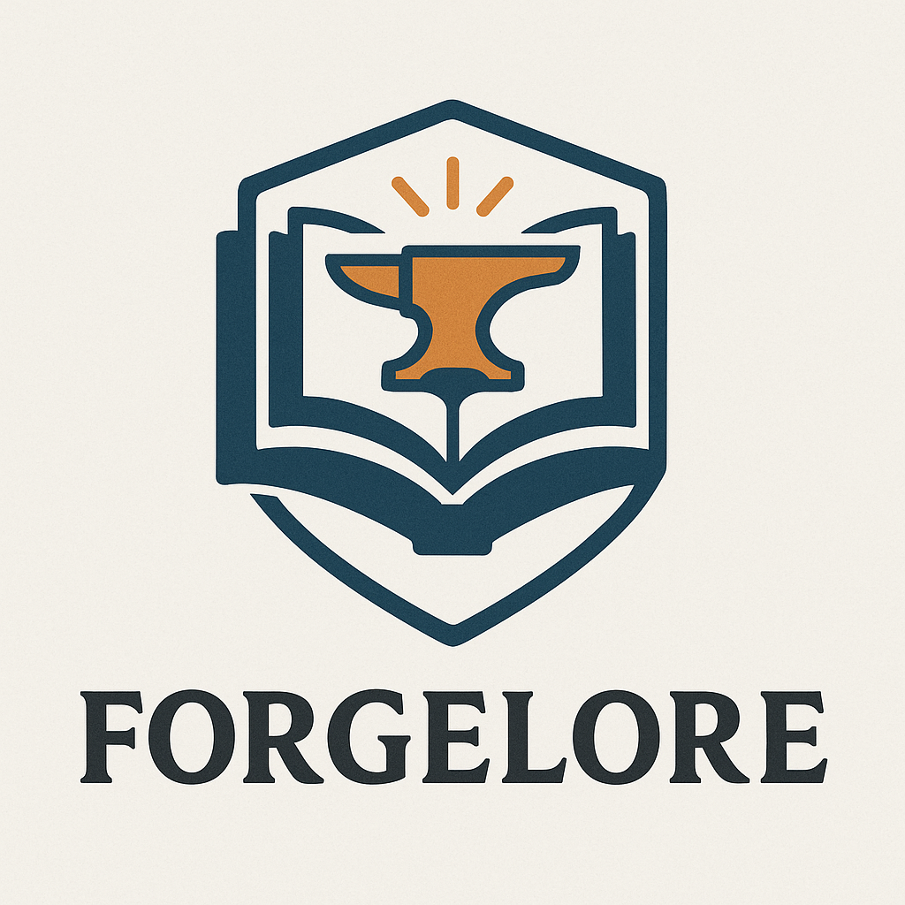

## ForgeLore — The Copilot for Science

ForgeLore is the Copilot for science—an autonomous researcher that searches literature, tests ideas, and drafts papers, turning months of R&D into days.



<!-- shield of the website! https://forgelore.ca -->


---

## What it does (today)
- **Parallel literature search**: Query arXiv, DOAJ, Semantic Scholar, and OpenAlex together. Link results to a project as citations, with open‑access PDFs detected where possible.
- **Project workspace**: Organize research as Projects with a one‑to‑one Paper plus Hypotheses, Experiments, Notes, and Citations.
- **Paper drafting in LaTeX**: Edit raw LaTeX with live preview. One‑click Recompile uses a compilation agent to regenerate a coherent draft from project context.
- **Code experiments**: Run small simulations in Python with parameters; capture stdout/stderr and persist structured `result_json`.
- **Autonomous pipeline**: Background automation chains Initial Research → Initial Draft → Hypothesis Testing → Compilation. Task status is visible in the UI.
- **Voice to text helper**: Optional audio transcription endpoint to quickly capture project descriptions.
- **Clean, enterprise UI**: Server‑rendered Django + Tailwind with a left sidebar workspace and professional tone.

---

## How it works

### Research services
Async provider modules normalize responses to a common `PaperRecord` and run in parallel via an aggregator.

- arXiv (`main/research_services/arxiv.py`)
- DOAJ (`main/research_services/doaj.py`)
- Semantic Scholar (`main/research_services/semanticscholar.py`)
- OpenAlex (`main/research_services/openalex.py`)

Example:
```python
from main.research_services import HttpClient, search_all

async def run_query(q: str):
    client = HttpClient()
    try:
        return await search_all(client, query=q, limit_per_source=10, mailto="you@example.com")
    finally:
        await client.aclose()
```

Environment: `OPENALEX_MAILTO` (recommended), `SEMANTIC_SCHOLAR_API_KEY` (optional). HTTP retries/backoff are built in.

### Agents and automation
Agent managers live under `agents_sdk/` and are orchestrated from the Project page.

- `InitialResearchServiceManager`: formalizes abstract, searches and summarizes literature, proposes hypotheses.
- `PaperDraftServiceManager`: generates initial draft when the Paper is empty.
- `HypothesisTestingServiceManager`: researches background, decides if simulation is needed, optionally runs a toy experiment, then answers.
- `CompilationServiceManager`: compiles a full LaTeX manuscript and persists changes if different.

Automation runs as a background job with per‑task status (`initial_research`, `initial_draft`, `hypothesis_testing`, `compilation`).

### Application pages
- **Dashboard**: KPIs, recent activity, quick actions.
- **Projects**: list/create projects; optional PDF/TXT import and mic‑to‑text for descriptions.
- **Project detail**: tabs for Overview, Paper (editor + preview), Literature, Experiments, Hypotheses, Notes, Automation.
- **Literature search**: query providers in parallel and link results to a project.
- **Experiments**: create, run, and inspect code‑based simulations.

---

## Quickstart

Prerequisites: Python 3.10+

### Windows PowerShell
```powershell
py -m venv venv
./venv/Scripts/Activate.ps1
pip install -r requirements.txt
python manage.py migrate
python manage.py runserver
```

### macOS/Linux
```bash
python3 -m venv venv
source venv/bin/activate
pip install -r requirements.txt
python manage.py migrate
python manage.py runserver
```

optionally create a superuser for admin access
```bash
python manage.py createsuperuser
```

Open `http://127.0.0.1:8000/`.

---

## Usage
1. Create a Project (optionally upload a PDF/TXT draft to seed the Paper).
2. Use Literature Search to find papers; use “Link to project” to add citations.
3. Add Hypotheses and create Experiments; run to capture results.
4. Edit the Paper and click Recompile to regenerate a LaTeX draft.
5. Check over automation status on the Automation tab as it works it way through the pipeline!
6. Optionally chat with the project assistant that is a supercharged ai agent system that has access to the project's data and can help you with your research further.

---

## Configuration
- `DJANGO_SECRET_KEY`: set in production.
- `DEBUG`: `True` (dev) / `False` (prod).
- `ALLOWED_HOSTS`: production hostnames.
- `OPENAI_API_KEY`: required for advanced agent features when enabled.
- `OPENALEX_MAILTO`: polite use of OpenAlex.
- `SEMANTIC_SCHOLAR_API_KEY`: optional.

---

## Repository layout
- `forgelore/`: Django project (settings, ASGI/WSGI).
- `main/`: app models, views, `research_services/`, utils, and tests.
- `templates/`: server‑rendered UI (e.g., `base.html`, `dashboard.html`, `projects_detail.html`).
- `static/`: images and assets.
- `agents_sdk/`: domain‑specific agent managers and tools.
- `openai-agents-python/`: vendored OpenAI Agents SDK and examples.

---

## Roadmap
- Expand provider features and OA filters/imports.
- Richer experiment runners and result visualization.
- Section‑aware drafting with numbered citations and references.
- Full autonomous multi‑turn loop with approvals.

---

## Contributing
Please read `CONTRIBUTING.md` for setup, style, and PR guidelines.

---

## Acknowledgements
- arXiv, DOAJ, Semantic Scholar, OpenAlex
- OpenAI Agents SDK


