```mermaid
flowchart TD
  %% =====================
  %% ForgeLore Research Automation Flow
  %% =====================

  %% Styles
  classDef mgr fill:#1e293b,stroke:#0ea5e9,stroke-width:1px,color:#e5e7eb,rx:6,ry:6
  classDef agent fill:#0b3d91,stroke:#60a5fa,stroke-width:1px,color:#f0f9ff,rx:6,ry:6
  classDef tool fill:#065f46,stroke:#34d399,stroke-width:1px,color:#ecfdf5,rx:6,ry:6
  classDef model fill:#3f3f46,stroke:#a1a1aa,stroke-width:1px,color:#fafafa,rx:6,ry:6
  classDef view fill:#7c2d12,stroke:#fb923c,stroke-width:1px,color:#fff7ed,rx:6,ry:6
  classDef data fill:#1f2937,stroke:#9ca3af,stroke-width:1px,color:#f3f4f6,rx:6,ry:6
  classDef note fill:#312e81,stroke:#a78bfa,stroke-width:1px,color:#eef2ff,rx:6,ry:6

  %% Entry point from Django view
  V1[projects_create @views.py\n_start_automation_background]:::view
  subgraph AUTO["Automation Pipeline (Background Thread) @views.py"]
    direction TB
    J[AutomationJob RUNNING]:::data
    T1[Task: initial_research]:::data
    T2[Task: initial_draft]:::data
    T3[Task: hypothesis_testing]:::data
    T4[Task: compilation]:::data
  end

  V1 --> J --> T1 --> T2 --> T3 --> T4

  %% Initial Research Manager and Agents
  subgraph IR["Initial Research @agents_sdk/initial_research_agents/manager.py"]
    direction TB
    IRM[InitialResearchServiceManager]:::mgr
    A1[formalizer_agent\n-FormalizedAsk-]:::agent
    A2[literature_reviewer_agent\n-LiteratureReviewOutcome-]:::agent
    A3[literature_summarizer_agent\n-ProjectFocusedSummary-]:::agent
    A4[hypothesizer_agent\n-HypothesesOutput-]:::agent

    %% Tools used by IR agents
    subgraph IRTOOLS["Tools @initial_research_agents/tools.py"]
      direction TB
      TL1[literature_search\n-search_all providers-]:::tool
      TL2[list_literature]:::tool
      TL3[read_literature]:::tool
      TL4[link_literature]:::tool
      TL5[get_paper]:::tool
      TL6[list_experiments]:::tool
      TL7[get_experiment]:::tool
      TL8[create_experiment]:::tool
      TL9[run_experiment]:::tool
      TL10[list_hypotheses]:::tool
      TL11[create_hypothesis]:::tool
      TL12[update_hypothesis_status]:::tool
      TL13[create_note / get_note / list_notes / update_note]:::tool
      TL14[pip_install_library]:::tool
    end

    IRM -->|context build| A1 -->|improved_abstract| IRM
    IRM --> A2 --> IRM
    A2 -->|uses| TL1
    A2 -->|uses| TL4
    IRM --> A3 --> IRM
    A3 -->|uses| TL2
    A3 -->|uses| TL3
    IRM --> A4 --> IRM
    A4 -->|uses| TL6
    A4 -->|uses| TL2
    A4 -->|uses| TL11
    A4 -->|optional| TL12
  end

  T1 -->|run_for_project_sync| IRM
  IRM -->|updates Paper.abstract; creates Note| N1[Note: Literature Summary]:::note

  %% Paper Draft Manager and Agent
  subgraph PD["Initial Draft @agents_sdk/paper_draft_agents/manager.py"]
    direction TB
    PDM[PaperDraftServiceManager]:::mgr
    A5[drafting_agent\n-DraftSections-]:::agent
    PDM --> A5 --> PDM
    A5 -->|uses| TL2
    A5 -->|uses| TL3
    A5 -->|uses| TL10
    A5 -->|uses| TL5
  end
  T2 -->|skip if paper has content| PDM
  PDM -->|sets Paper.abstract; appends Literature Review| Paper1[Paper.content_raw]:::data

  %% Hypothesis Testing Manager and Agents
  subgraph HT["Hypothesis Testing @agents_sdk/hypothesis_testing_agents/manager.py"]
    direction TB
    HTM[HypothesisTestingServiceManager]:::mgr
    A6[research_agent\n-HypothesisResearch-]:::agent
    A7[sim_decider_agent\n-SimulationDecision-]:::agent
    A8[simulation_agent\n-SimulationResult-]:::agent
    A9[answer_agent\n-HypothesisAnswer-]:::agent

    HTM --> A6 --> HTM
    A6 -->|uses| TL1
    A6 -->|uses| TL2
    A6 -->|uses| TL3

    HTM --> A7 --> HTM
    HTM -->|if needed| A8 --> HTM
    A8 -->|uses| TL14
    A8 -->|uses| TL8
    A8 -->|uses| TL9
    A8 -->|uses| TL7

    HTM --> A9 --> HTM
    A9 -->|updates| TL12
  end
  T3 --> HTM

  %% Compilation Manager and Agent
  subgraph CP["Compilation @agents_sdk/compilation_agents/manager.py"]
    direction TB
    CPM[CompilationServiceManager]:::mgr
    A10[compilation_agent\n-FullLatexPaper-]:::agent
    CPM --> A10 --> CPM
    A10 -->|uses| TL5
    A10 -->|uses| TL2
    A10 -->|uses| TL10
  end
  T4 --> CPM
  CPM -->|writes LaTeX to Paper.content_raw\nformat=LATEX| Paper2[Paper -LaTeX-]:::data

  %% Chat Assistant (separate box)
  subgraph CHAT["Project Chat Assistant @agents_sdk/project_chat_agents/manager.py"]
    direction TB
    CMM[ProjectChatServiceManager]:::mgr
    CAG[chat_agent\n-ChatAssistantReply-]:::agent
    CMM --> CAG
    %% Chat tools (re-use IR tools set)
    CAG -->|uses| TL1
    CAG -->|uses| TL2
    CAG -->|uses| TL3
    CAG -->|uses| TL4
    CAG -->|uses| TL5
    CAG -->|uses| TL6
    CAG -->|uses| TL7
    CAG -->|uses| TL8
    CAG -->|uses| TL9
    CAG -->|uses| TL10
    CAG -->|uses| TL11
    CAG -->|uses| TL12
    CAG -->|uses| TL13
    CAG -->|uses| TL14
  end

  %% Data models (DB) touched
  subgraph DB["Core Models @main/models.py"]
    direction TB
    M1[Project]:::model
    M2[Paper]:::model
    M3[Note]:::model
    M4[Literature]:::model
    M5[Citation]:::model
    M6[Hypothesis]:::model
    M7[Simulation]:::model
    M8[AutomationJob/Task]:::model
  end

  %% Link managers to models
  IRM --- M1
  IRM --- M2
  IRM -.create.-> M3
  IRM -.link via TL4.-> M4
  IRM -.create.-> M6

  PDM --- M1
  PDM --- M2

  HTM --- M1
  HTM --- M6
  HTM -.create/run.-> M7

  CPM --- M2

  %% Automation job/task tracking
  J --- M8
  T1 --- M8
  T2 --- M8
  T3 --- M8
  T4 --- M8

  %% Legend
  subgraph LEGEND[Legend]
    direction LR
    LG1[Manager]:::mgr
    LG2[Agent]:::agent
    LG3[Tool]:::tool
    LG4[Model]:::model
    LG5[View/Trigger]:::view
    LG6[Data/Content]:::data
    LG7[Note]:::note
  end
```

Notes:
- Flow follows the orchestration in `main/views.py` `_start_automation_background`: Initial Research → Initial Draft (skipped if content exists) → Hypothesis Testing → Compilation.
- The chat assistant is independent and can be used at any time; it has access to the same project tools.
- Tools group reflects `agents_sdk/initial_research_agents/tools.py` and are reused by other agents.

